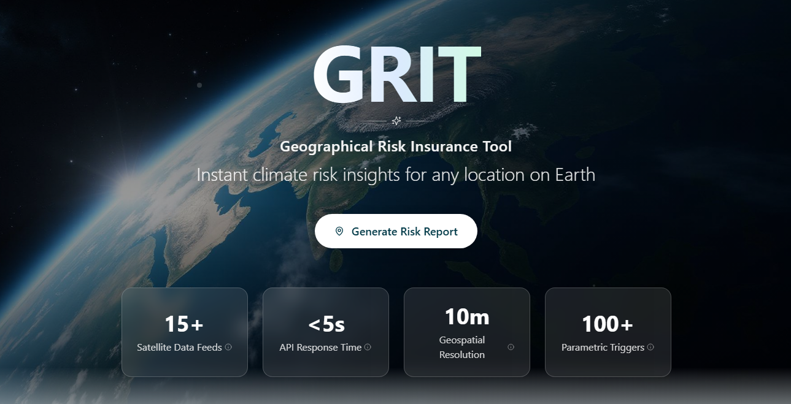

# Geographical Risk Insurance Tool (GRIT)

* [Description](#description)
* [Running the app](#running-the-app)
* [Guide](#guide)
* [Future developments](#future-development)

## Description

Prototype built in 24 hours using Lovable and Google Cloud for [MITxOpenAI Hack-Nation Global](https://hack-nation.ai/):
   - Try [GRIT](https://grit-preinsurance.lovable.app)
   - Watch 60-sec [demo video](https://drive.google.com/file/d/19i3dSE6TcBiJi3k7GW5UsjtoulMT2fvo/view?usp=drive_link) [Outdated as of 12/2025]

**Results**:
   - Placed [3rd (VC track) out of >2800](https://www.linkedin.com/posts/shohail-ismail_hacknation-mit-openai-activity-7394305524978118656-z1nX?utm_source=share&utm_medium=member_desktop&rcm=ACoAACFbMOkB922BZ9kyXvbVxTlEYv4HhtSH-Iw) participants
   - Selected as 1 of 15 ventures to receive mentorship from Stanford, Harvard, and Microsoft to develop and scale idea (ongoing)

---



---

GRIT is a real-time climate risk assessment tool for insurance, reinsurance, and catastrophe-modelling teams. It delivers sub-10m geospatial analysis with feeds from over 15 satellites, <5 second response time from all APIs, and over 100 parameters for payout scenarios, providing reliable, explainable, data-driven insurance estimates.

Designed to answer the core underwriting question: *What are the climate-related financial risks to insure someone in this area, both historically and now?*

### Key outcomes (quantitative)

* 37-point concentric grid per query (1 centre + 3 rings of 6, 12, and 18 nodes)
* 4 hazard composites (flood, wildfire, storm, drought) with overall risk score
* <5s second average API response time
* 10m resolution using Sentinel-1/2 data via Copernicus API
* Exponential severity scaling (`riskFactor^1.2`) for loss estimation
* Serverless auto-scaling via Supabase Edge Functions + Lovable Cloud

### Technology stack

* **Frontend**: React 18, TypeScript, Vite, Tailwind CSS
* **Backend**: Lovable Cloud (Supabase), Edge Functions (Deno)
* **Mapping**: Leaflet with heat layer visualisation
* **Charts**: Recharts for risk comparison
* **Formulas**: react-katex for LaTeX rendering of calculation methodologies
* **Data sources**: Open-Meteo API, Copernicus Sentinel Hub

---

## Running the app

### Requirements

* Node.js 18+
* npm

### Environment setup (auto-configured in production)

```
VITE_SUPABASE_URL=<>
VITE_SUPABASE_PUBLISHABLE_KEY=<>
VITE_SUPABASE_PROJECT_ID=<>
```

### Satellite analysis API

```
COPERNICUS_CLIENT_ID=
COPERNICUS_CLIENT_SECRET=
```

### Run

```bash
npm install
npm run dev
```

---

## Guide

1) **Enter a location** in the frontend (latitude/longitude or use current location)
   GRIT builds a concentric 37-point grid and fetches climate, demographic, and satellite features

2) **Edge Functions** run hazard modules:
   * `analyse-location`: Fetches climate/elevation data from Open-Meteo, calculates flood, wildfire, storm, and drought risk scores
   * `enrich-demographics`: Generates demographic grid with population density, urbanisation, age/income estimates, and payout calculations
   * `ingest-satellite-data`: Processes Sentinel-1/2 imagery for SAR flood detection and NBR wildfire classification

3) **Risk algorithm** calculates:
   * Individual hazard severity (0-100 scale)
   * Overall Risk Score (weighted average of 4 risk types)
   * Demographic-weighted exposure estimates
   * Parametric payout ranges (expected, 75th, 90th percentile, PML)

4) **Frontend displays**:
   * Interactive Leaflet map with concentric risk nodes and satellite layer toggle
   * Overall Risk Score with clickable detailed explanations
   * Risk Comparison bar chart (Recharts) with interactive breakdowns
   * LaTeX-rendered calculation methodologies for full transparency
   * Quick Summary showing dominant risk type and analysis parameters
   * CSV export for underwriting/reinsurance submissions

---

## Future Development

1) **Satellite methods are production-aligned**:

   The SAR and NBR pipelines follow standard remote-sensing practice:
   * SAR flood detection via Sentinel-1
   * NBR/dNBR wildfire classification using USGS thresholds

   These methods are simplified for serverless limits but retain the correct scientific structure.

2) **Data pipeline designed for real underwriting workflows**:
   * Supabase PostGIS stores analysis results (`geospatial_analysis`, `satellite_data` tables)
   * Storage bucket for geospatial products (GeoTIFF/Shapefile export)
   * Webhook support for automated satellite data ingestion

3) **Scoring model intentionally transparent**:

   Risk teams favour explainability over black-box ML. GRIT uses clear, auditable components with LaTeX formula rendering:
   * 4 hazard metrics with individual calculation breakdowns
   * Demographic-weighted exposure
   * Exponential severity scaling
   * Percentile-based payout estimates

4) **Built for speed, reliability, and handover**:

   Current architecture includes modular edge functions, request batching, and clean component separation. UK English spelling conventions used throughout codebase.

5) **Future extensions planned during mentorship**:
   * Portfolio-level correlation modelling
   * Real-time parametric alerts (webhook-based triggers)
   * Direct GDAL-backed satellite band processing
   * Time-series hazard trends (5-10 year lookback)
   * Enhanced authentication and user analysis history
